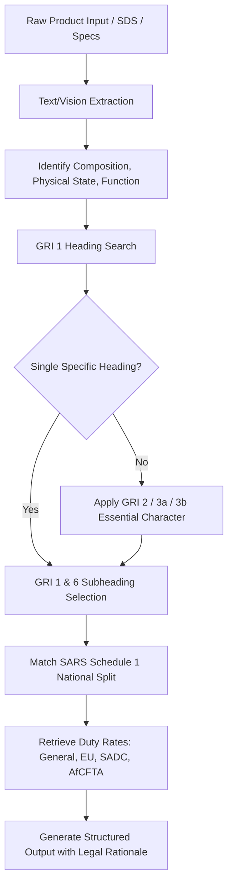

# Workflow 2: Autogen HS Codes (Direct Classification)

## Objective
Generate compliant 6-digit WCO Harmonized System codes and 8-digit SARS Schedule 1 Part 1 national split tariff codes directly from unformatted commercial descriptions, product specifications, SDS (Safety Data Sheets), or technical parameters.

---

## Trigger
- User inputs raw product description, composition, CAS numbers, or photos of chemical/industrial goods.
- Bulk batch query of unclassified items.

---

## Step-by-Step Execution Plan

### Step 1: Input Analysis
Parse the input parameters:
- **Commercial / Trade Name:** (e.g., "SyntheLube Ultra ISO 46")
- **Constituent Ingredients / Percentages:** (e.g., "65% synthetic polyalphaolefin, 25% mineral oil, 10% anti-wear additive")
- **Form / State:** (e.g., Liquid, Aerosol, Granule)
- **Primary Function:** (e.g., Hydraulic fluid, industrial lubricant)
- **Packaging:** (e.g., 200L steel drums or 500ml retail bottles)

### Step 2: WCO GRI Algorithmic Reasoning
1. **Chapter Identification:** Evaluate candidate chapters (27, 32, 34, 35, 38, 68).
2. **Exclusion Check:** Confirm no Section or Chapter exclusions apply.
3. **Essential Character Determination (GRI 3b):** If composite or mixture, determine the constituent providing the primary function.
4. **Subheading Determination (GRI 6):** Pinpoint the exact 6-digit subheading.

### Step 3: SARS Schedule 1 National Split Assignment
1. Query `cache/sars_tariff_schedule1.json` under the identified 6-digit subheading.
2. Select the specific 8-digit national code based on retail packaging or formulation thresholds.
3. Retrieve the official SARS Check Digit.
4. Extract the duty rates:
   - General Duty (MFN)
   - EU EPA rate
   - SADC rate
   - AfCFTA rate

### Step 4: Auditor Output Schema
Return the classification result containing:
- Recommended 6-digit WCO HS Code
- Recommended 8-digit SARS Tariff Code + Check Digit
- Official SARS Tariff Description
- Applicable Duty Rates (%)
- Legal Classification Rationale citing specific WCO GRI Rules and Chapter Notes
- Alternative candidate headings considered and reason for exclusion
