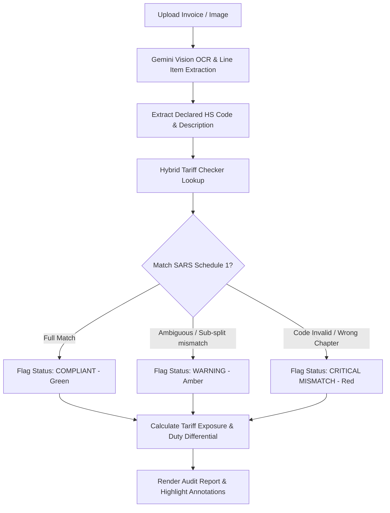

# Workflow 1: Validate and Highlight (Customs Audit)

## Objective
Automate the cross-checking of handwritten or printed Harmonized System (HS) codes declared on commercial shipping invoices, packing lists, and SARS Customs Declaration (SAD500) documents against the actual physical item descriptions.

---

## Trigger
- User uploads an image/scan of a commercial invoice, bill of lading, or customs declaration.
- User submits a line-item with declared handwritten HS code and item description.

---

## Step-by-Step Execution Plan

### Step 1: Vision Extraction
1. Load `prompts/validation_prompt.txt`.
2. Inspect the document image using Gemini 2.5 Flash Vision.
3. Extract each line item with:
   - Line number
   - Declared product description
   - Declared/Handwritten HS code
   - Declared unit quantity and invoice currency/value

### Step 2: Hybrid Tariff Verification
1. Cleanse the declared code (strip spaces, slashes, punctuation).
2. Query `cache/sars_tariff_schedule1.json` to verify:
   - Is the 6-digit heading valid under the WCO Harmonized System?
   - Does the 8-digit SARS national split exist?
   - Is the check digit valid?
3. Execute GRI classification check against item description to determine if the declared code accurately describes the goods.

### Step 3: Discrepancy Classification & Severity
- **🟢 VALID (Green):** Declared HS code matches the product description and exists in the SARS tariff schedule with matching rate of duty.
- **🟡 AMBER WARNING:**
  - Valid 6-digit subheading, but national 8-digit split is outdated or incorrect.
  - Missing or erroneous check digit.
  - Vague invoice description requiring additional technical data sheets (TDS).
- **🔴 CRITICAL MISCLASSIFICATION (Red):**
  - Declared code does not exist in SARS Schedule 1 Part 1.
  - Chapter mismatch (e.g., declared in Chapter 27 as mineral oil when composition indicates Chapter 34 preparation).
  - Tariff hopping indication: declared code carries 0% duty while correct code carries 10%-15% duty, exposing the importer to SARS Section 84 false declaration penalties.

### Step 4: Output & Report Generation
1. Display results in the Web UI with color-coded audit badges.
2. Calculate potential duty liability delta:
   $$\text{Duty Exposure} = \text{Customs Value} \times (\text{Correct Duty Rate} - \text{Declared Duty Rate})$$
3. Provide option to export an official PDF Audit Memo using `pdf_exporter.py`.
